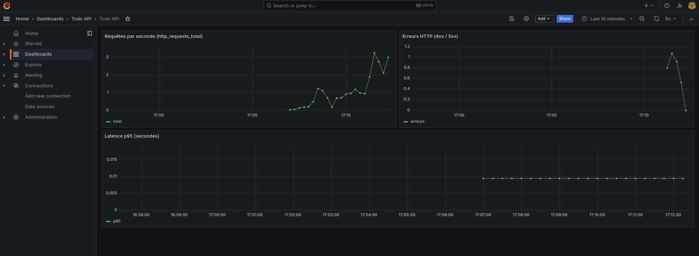
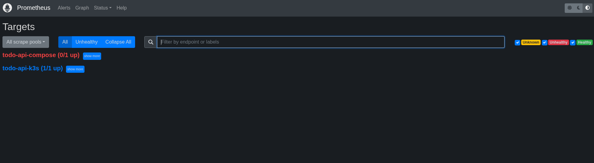
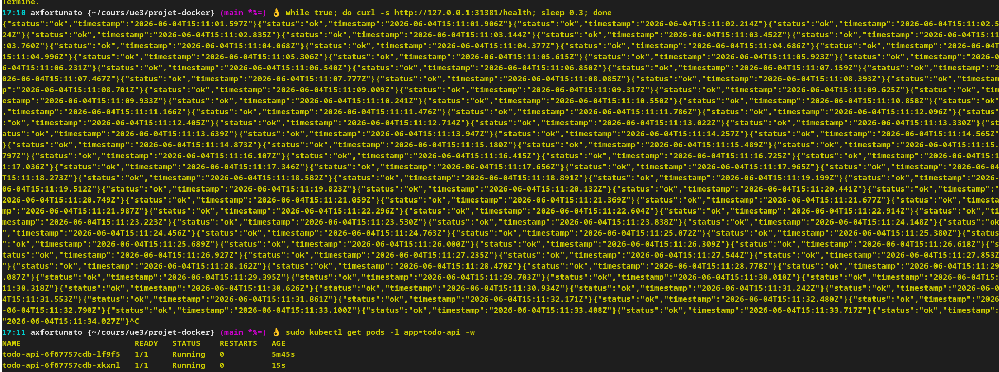
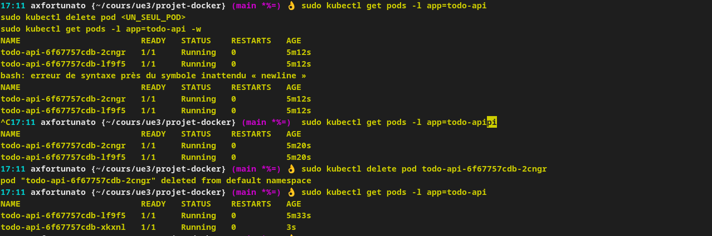

# Todo API — IPSSI / DevOps Partie 1

API REST de tâches (Node.js + PostgreSQL), dockerisée. Projet solo.

## Structure du projet

```
.
├── src/
│   ├── routes/tasks.js
│   ├── models/task.js
│   ├── middleware/errorHandler.js
│   ├── logger.js
│   ├── db.js
│   ├── app.js
│   └── index.js
├── db/init.sql
├── tests/
├── Dockerfile
├── docker-compose.yml
├── package.json
└── README.md
```

## Modèle Task

| Champ | Type | Obligatoire |
|-------|------|-------------|
| `id` | UUID | oui |
| `title` | string | non |
| `description` | string | non (défaut `""`) |
| `status` | string | oui (`todo` par défaut) |
| `createdAt` | timestamp | auto |
| `updatedAt` | timestamp | auto |

## API

Base : `http://localhost:3000`

| Méthode | Route |
|---------|-------|
| GET | `/health` |
| GET | `/api/tasks` |
| GET | `/api/tasks/:id` |
| POST | `/api/tasks` |
| PUT | `/api/tasks/:id` |
| DELETE | `/api/tasks/:id` |

## Lancer le projet

```bash
docker compose up --build -d
curl http://localhost:3000/health
```

Identifiants PostgreSQL (compose du cours) : `todo_user` / `todo_pass`, base `todo_db`.

## Test de persistance 

```bash
curl -X POST http://localhost:3000/api/tasks \
  -H "Content-Type: application/json" \
  -d '{"title":"Tâche persistante","status":"todo"}'

docker compose down
docker compose up -d

curl http://localhost:3000/api/tasks
```

Les tâches doivent encore être présentes.

## Test de persistance des logs 

Générer des entrées dans le volume `api-logs` :

```bash
curl http://localhost:3000/health
curl -X POST http://localhost:3000/api/tasks \
  -H "Content-Type: application/json" \
  -d '{"title":"Test logs","status":"todo"}'

docker compose exec api cat /app/logs/access.log
```

Vérifier que les logs survivent au redémarrage :

```bash
docker compose down
docker compose up -d

docker compose exec api cat /app/logs/access.log
# les lignes précédentes sont toujours là
```

Lire le volume depuis un **autre conteneur** (partage entre process) :

```bash
docker run --rm -v projet-docker_api-logs:/logs alpine cat /logs/access.log
```

Mission réussie si : les fichiers `app.log` / `access.log` existent après `down` puis `up` (sans `-v`).

### Questions du cours

- **Pourquoi `./src` n’est pas dans `volumes:` ?** C’est un bind mount (chemin hôte → conteneur), pas un volume Docker nommé.
- **`docker compose down -v` ?** Supprime les volumes nommés : BDD et logs effacés.
- **Comment tester la persistance des logs ?** Faire des requêtes HTTP pour remplir `access.log`, noter le contenu avec `docker compose exec api cat /app/logs/access.log`, puis `docker compose down` et `up -d` (sans `-v`) : le fichier doit être identique. On peut aussi monter `api-logs` dans un conteneur tiers (`alpine`) pour prouver que le volume est partagé et persistant.

## Dev local

```bash
npm install
npm start
```

Copier `.env.example` → `.env`. Lancer PostgreSQL avec les mêmes identifiants.

### Execution


# Todo API - Pipeline CI/CD (projet groupe)

## Membres
- Ayman Mougou (@Tintin200)
- Killian Octau (@KillianOCTAU)
- Axel Fortunato (@FortAxel)

## Image DockerHub
`axfortunato/todo-api`

## Déploiement K3s (phase 4)

```bash
sudo kubectl apply -f k8s/
./scripts/k3s-deploy-image.sh
sudo kubectl get pods -l app=todo-api
curl http://127.0.0.1:31381/health
```

Pipeline CI : `.gitlab-ci.yml` (`build-and-push` + `deploy-k3s` sur `main`).

---

## Monitoring (phase 5)

**Stack :** API sur **K3s** ; Prometheus + Grafana : `docker compose up -d prometheus grafana`.

Commandes : **[METRICS.md](./METRICS.md)** — `./scripts/traffic.sh http://127.0.0.1:31381 happy`

### Tableau de métriques

| Métrique | Valeur mesurée | Comment l’obtenir |
|----------|----------------|-------------------|
| Durée totale pipeline (lint → deploy) | _à mesurer_ | GitLab → pipeline `main` → durée totale |
| Taille image Docker (avant optimisation) | _à mesurer_ | `docker images axfortunato/todo-api:latest` |
| Taille image Docker (après optimisation) | Phase 6 | — |
| Temps rolling update | _à mesurer_ | Job `deploy-k3s` ou `kubectl rollout status deployment/todo-api` |
| Nombre de pods en charge | **2** | `kubectl get pods -l app=todo-api` |
| Latence p95 API (Grafana) | _à mesurer_ | Dashboard **Todo API** → *Latence p95* |

### Captures

Fichiers dans [`docs/captures/`](docs/captures/).

#### Grafana



#### Prometheus



#### Trafic (curl)



#### Scénario adverse — suppression d’un pod



---

## Fichiers du repo (aperçu)

```
k8s/
monitoring/
src/metrics.js
scripts/traffic.sh
scripts/k3s-deploy-image.sh
docs/captures/
METRICS.md
```